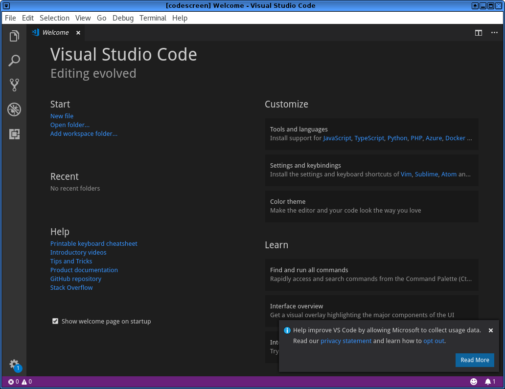
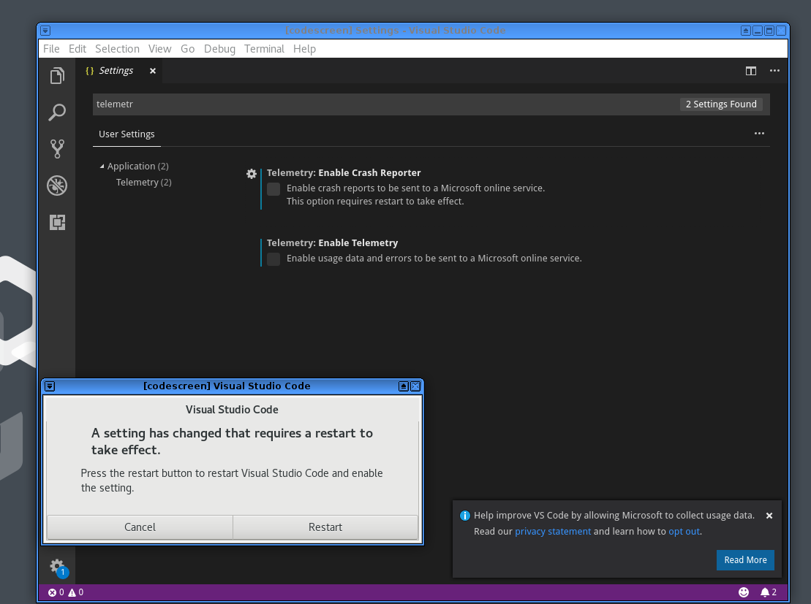
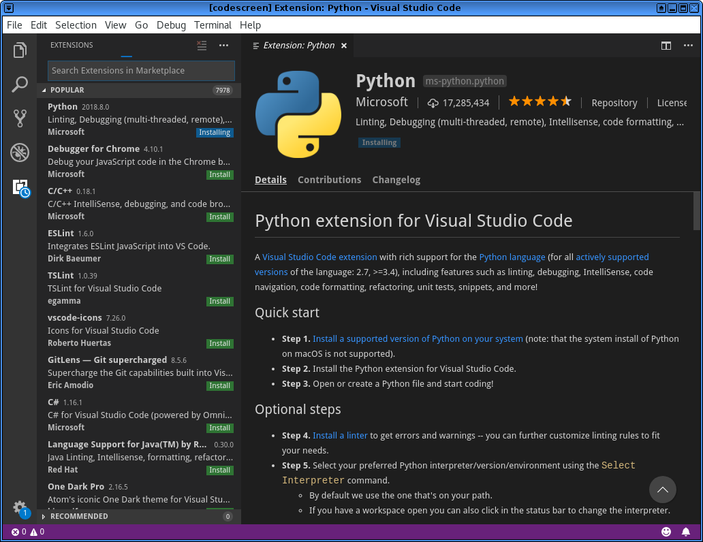

Using VS Code as your primary Python editor
===========================================

If you have reached this chapter in the book, then I think you can take a
step up in the programming world by using a new editor which has a lot more
features than our starting editor (mu).

`VS Code <https://code.visualstudio.com/>`_ is an Open Source multi-platform
code editor from Microsoft which I personally like a lot. In this chapter, I
am going to show you how you can start using it.

Installing VS Code
------------------

Download and install VS Code in your Linux distribution following `the official
guidelines <https://code.visualstudio.com/docs/setup/linux>`_. Please make
sure that you are following all the steps given in that page. You should add
the project repository properly (either deb or rpm repo) and always verify the
package (the gpg signed packages in the repo makes it easier).

Remember that VS Code ships monthly, means every month you will get update of
this editor with many new features and bug fixes as required.

Using VS Code
-------------

The above is the starting screen of VS Code, you should notice the small
information box in the right hand corner.

You can disable ``telemetry`` and thus sending the commands and other
information that Microsoft collects. Go to the settings page by
using ``File->Preference->Settings`` in the menu.

Install the Python extension
-----------------------------

The next step would be to install the `Python extension
<https://marketplace.visualstudio.com/items?itemName=ms-python.python>`_ in VS Code.
Go to "Extensions" from the left hand activity bar, and install the Python
extension.

Start working on your code
---------------------------

Now, you can start working on your favorite project. Open up the directory in
VS Code, and start editing.

Feel free to go through the `VS Code documentation
<https://code.visualstudio.com/docs/getstarted/tips-and-tricks>`_ to learn more about the editor.

We will add a few more things in this chapter later.
