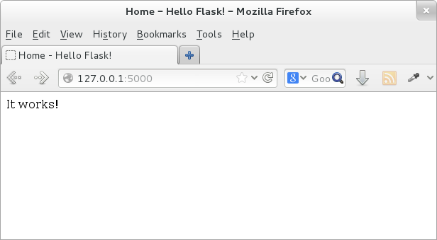
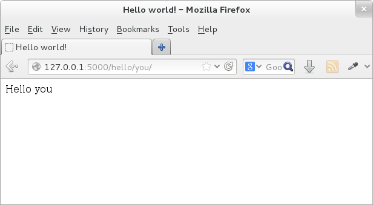

Introduction to Flask
=====================

What is flask?
--------------

`Flask <http://flask.pocoo.org/>`_ is a web framework. This means flask provides
you with tools, libraries and technologies that allow you to build a web
application. This web application can be some web pages, a blog, a wiki or go as
big as a web-based calendar application or a commercial website.

Flask is part of the categories of the micro-framework. Micro-framework are
normally framework with little to no dependencies to external libraries. This
has pros and cons. Pros would be that the framework is light, there are little
dependency to update and watch for security bugs, cons is that some time you
will have to do more work by yourself or increase yourself the list of
dependencies by adding plugins.
In the case of Flask, its dependencies are:

* `Werkzeug <http://werkzeug.pocoo.org/>`_ a WSGI utility library
* `jinja2 <http://jinja.pocoo.org/>`_ which is its template engine

.. note:: WSGI is basically a protocol defined so that Python application can
   communicate with a web-server and thus be used as web-application outside of
   CGI.

What are template engines?
--------------------------

Have you ever built a website? Did you face the problem that to keep the style
of the website consistent, you have had to write multiple times the same text?
Did you ever tried to change the style of such website?

If your website contains only few pages, changing its style will take you some
time but is doable. However, if you have a lot of pages (for example the list of
items you sell in your store), this task become overwhelming.

Using templates you are able to set a basic layout for your pages and mention
which element will change.
This way you can define your header once and keep it consistent over all the pages of
your website, and if you need to change your header, you will only have to
update it in one place.

Using a template engine will save you a lot of time when creating your
application but also when updating and maintaining it.

A "Hello world" application in flask
-------------------------------------

We are going to perform a very basic application with flask.

* Create the structure of the project

::

 mkdir -p hello_flask/{templates,static}

This is the basic structure of your web application::

 $ tree hello_flask/
 hello_flask/
 |-- static
 `-- templates

The ``templates`` folder is the place where the templates will be put.
The ``static`` folder is the place where any files (images, css, javascript)
needed by the web application will be put.

* Create the application file

::

 cd hello_flask
 vim hello_flask.py

Put the following code in this file::

 #!/usr/bin/env python

 import flask

 # Create the application.
 APP = flask.Flask(__name__)

 @APP.route('/')
 def index():
     """ Displays the index page accessible at '/'
     """
     return flask.render_template('index.html')

 if __name__ == '__main__':
     APP.debug=True
     APP.run()

* Create the template ``index.html``

::

 vim templates/index.html

Put the following code in this file

.. code-block:: html

 <!DOCTYPE html>
 <html lang='en'>
 <head>
   <meta charset="utf-8" />
   <title>Hello world!</title>
   <link type="text/css" rel="stylesheet"
         href="{{ url_for('static',
               filename='hello.css')}}" />
 </head>
 <body>
  
 It works!
  
 </body>
 </html>

* Run the flask application

::

 python hello_flask.py

Access `http://127.0.0.1:5000/ <http://127.0.0.1:5000/>`_ this should simply
show you in black on white the text "It works!" (see Figure below).

Using arguments in Flask
------------------------

In this section we are going to see how to use a page according to the URL used
by the user.

For this we will update ``hello_flask.py``.

* Add the following entry in ``hello_flask.py``

::

  @APP.route('/hello/<name>/')
  def hello(name):
      """ Displays the page greats who ever comes to visit it.
      """
      return flask.render_template('hello.html', name=name)

* Create the following template ``hello.html``

.. code-block:: html

  <!DOCTYPE html>
  <html lang='en'>
  <head>
      <meta charset="utf-8" />
      <title>Hello</title>
      <link type="text/css" rel="stylesheet"
            href="{{ url_for('static',
                 filename='hello.css')}}" />
  </head>
  <body>

        Hello {{name}}

  </body>
  </html>

* Run the flask application

::

 python hello_flask.py

Access `http://127.0.0.1:5000/ <http://127.0.0.1:5000/>`_ this should simply
show you in black on white the text "It works!".

Access `http://127.0.0.1:5000/hello/you <http://127.0.0.1:5000/hello/you>`_
this should return you the text "Hello you" (see Figure below).

Whatever you put behind ``/hello/`` in the URL will be returned to you in the
page.

This is your first use of the template, we set up a variable ``name`` in
``hello_flask.py`` (see the return line of the function ``hello``). This
variable is then displayed in the page itself using the syntax ``{{name}}``.

Additional work
----------------

Make use of the templates

At the moment for each page we have created a template, this is actually bad
practice, what we should do is create a ``master`` template and have each page
use it.

* Create the template ``master.html``

.. code-block:: html

  <!DOCTYPE html>
  <html lang='en'>
  <head>
    <meta charset="utf-8" />
    <title> - Hello Flask!</title>
    <link type="text/css" rel="stylesheet"
         href="{{ url_for('static',
                          filename='hello.css')}}" />
  </head>
  <body>

  

  </body>
  </html>

* Adjust the template ``index.html``

.. code-block:: html

  

  Home

  
  It works!
  

As you can see, in the ``master.html`` template we have defined two sections,
blocks which are named ``title`` and ``body``.

In the template ``index.html`` we say that this template relies on the template
``master.html``, then we define the content to put in these two sections
(blocks). In the first block ``title`` we say to put the word `Home`, In the
second block we define what we want to have in the body of the page.

* As an exercise, transform the other template ``hello.html`` to use the
  ``master.html`` template as well.

* Add link to the front page from the hello page

Flask uses a specific syntax to create links from a page to another. This is
fact generates the link dynamically according to the decorator set to the
function linked to. In addition it takes care of where the application is
deployed.

For example, if you website is deployed at: ``/myapp/`` flask will automatically
happend ``/myapp/`` to all links without the need for you to specify it.

To create a link in a template, flask relies on the function ``url_for()``. This
function takes as first argument the function you want to call (link to). The
following arguments are the arguments of function itself (for example the
argument ``name`` of the function ``hello``.

Adjust the template ``hello.html`` to add a link to the front page

::

 <a href="{{ url_for('index') }}"><button>Home</button></a>

* As an assignment add a link in the front page to the hello page for `you`.
