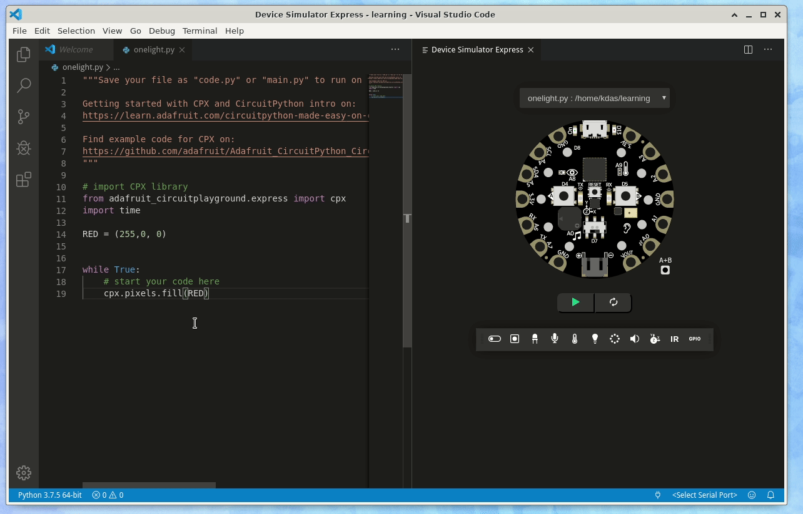
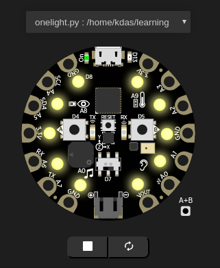
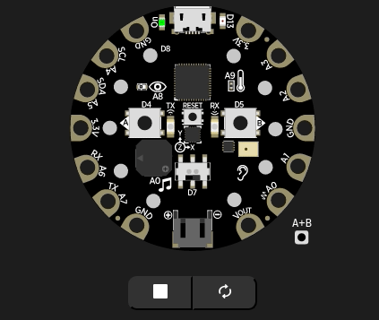
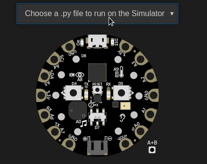

==================================
Learning using hardware simulation
==================================

From this section and in the future chapters, there will be examples and problems
which is using a special device simulation in VS Code editor. 

We will use the simulation to have a `Circuit Playground Express device <https://adafruit.com/product/3333>`_,
and learn to interact with the device. We will be able to turn on lights of different
colours, and many other nice examples.

.. note::

    Visit `Adafruit <https://www.adafruit.com>`_ website to find many amazing hardware and learning materials.

Circuit Playground Express
==========================

.. figure:: img/cpx.gif

The above is the image of the real hardware, in the simulation we will use,
we can use the following:

- Green LED
- Red LED
- Push Buttons A and B
- Slider Switch
- Speaker: Play .wav file
- 10 NeoPixels
- Light sensor
- Motion sensors
- Acceleration detection
- Device shake detection
- Temperature sensor
- 7 Capacitive Touch sensors

.. rst-class:: floater

.. seealso::

    Go to the (:doc:`editors`) to learn how to install VS Code and the device simulation,
    and then come back to this chapter.

Turning on all NeoPixels on the board with Red colour
=====================================================

::

    # import CPX library
    from adafruit_circuitplayground.express import cpx
    import time

    RED = (255,0, 0)

    while True:
        # start your code here
        cpx.pixels.fill(RED)

On the top of the code, we are writing a line starting with **from** to get the Python module
which can interact wtih the device, as **cpx**. Next line, we are also importing *time* module,
which we will use later.

Then we defined a colour Red in the *RED* variable as a (R, G, B) tuple.

Next, the `while True:` line starts a loop and it will keep running, and inside using the same indentation,
we call a function `cpx.pixels.fill` with the desired color (in this case RED).

Can you now write a code which will turn all the NeoPixel lights on the device Yellow? For this,
you will have to search the RGB value of Yellow.

.. rst-class:: html-toggle

Yellow light solution
---------------------

::

    from adafruit_circuitplayground.express import cpx
    import time

    YELLOW = (255, 255, 0)

    while True:
        # start your code here
        cpx.pixels.fill(YELLOW)

Learning about time.sleep
--------------------------

The `time` module has an important function, *sleep*, which takes the amount
of time the code will sleep (means it will do nothing), and then, the next
instruction will execute. We can use this to keep the light on or offf for
certain amount of time. Take the following example, where we are keeping the
NeoPixels on for 1 second and then, turning them off (RGB value (0,0,0)) for
0.5 seconds.

::

    # import CPX library
    from adafruit_circuitplayground.express import cpx
    import time

    WHITE = (255, 255, 255)
    OFF = (0, 0, 0)

    while True:
        # start your code here
        cpx.pixels.fill(WHITE)
        time.sleep(1)
        cpx.pixels.fill(OFF)
        time.sleep(0.5)

RGB problem
-------------

Can you modify the code in a such a way that it shows Red, and then Green and
then Blue on all NeoPixels? It will look like the following image.

.. rst-class:: html-toggle

RGB solution
--------------

::

    # import CPX library
    from adafruit_circuitplayground.express import cpx
    import time

    RED = (255, 0, 0)
    GREEN = (0, 255, 0)
    BLUE = (0, 0, 255)

    while True:
        cpx.pixels.fill(RED)
        time.sleep(1)
        cpx.pixels.fill(GREEN)
        time.sleep(1)
        cpx.pixels.fill(BLUE)
        time.sleep(1)

