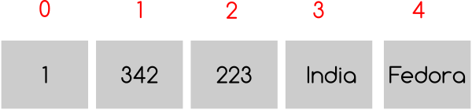

=======
Looping
=======

In the examples we used before , sometimes it was required to do the same work couple of times. We use a counter to check how many times the code needs to be executed. This technique is known as looping. First we are going to look into while statement for looping.

While loop
==========

The syntax for *while* statement is like

::

    while condition:
        statement1
        statement2

The code we want to reuse must be indented properly under the while statement. They will be executed if the *condition* is true. Again like in *if-else* statement any non zero value is true. Let us write a simple code to print numbers 0 to 10

::

    >>> n = 0
    >>> while n < 11:
    ...     print(n)
    ...     n += 1
    ...
    0
    1
    2
    3
    4
    5
    6
    7
    8
    9
    10

In the first line we are setting *n = 0*, then in the while statement the condition is *n < 11*, that means what ever line indented below that will execute until n becomes same or greater than 11. Inside the loop we are just printing the value of n and then increasing it by one.

How is this code going to help us in any real life? Think about the situation where you have to turn on 10 light bulbs one by one. May be you can run a loop from 1 to 10 and for each value on n, turn on the nth bulb.

Fibonacci Series
================

Let us try to solve *Fibonacci* series. In this series we get the next number by adding the previous two numbers. So the series looks like *1,1,2,3,5,8,13 .......*

::

    #!/usr/bin/env python3
    a, b = 0, 1
    while b < 100:
        print(b)
        a, b = b, a + b

The output

::

    $ ./fibonacci1.py
    1
    1
    2
    3
    5
    8
    13
    21
    34
    55
    89

In the first line of the code we are initializing *a* and *b*, then looping while b's value is less than 100. Inside the loop first we are printing the value of *b* and then in the next line putting the value of *b* to *a* and *a + b* to *b* in the same line.

In your print function call if you pass another argument called end and pass a space string, it will print in the same line with space delimiter. The default value for end is '\\n'.

::

    #!/usr/bin/env python3
    a, b = 0, 1
    while b < 100:
        print(b, end=' ')
        a, b = b, a + b

The output

::

    $ ./fibonacci2.py
    1 1 2 3 5 8 13 21 34 55 89

Power Series
============

Let us write a program to evaluate the power series. The series looks like e**x =1+x+x**2/2! +x**3/3! +....+ x**n/n! where 0 < x < 1

::

    #!/usr/bin/env python3
    x = float(input("Enter the value of x: "))
    n = term = num = 1
    sum = 1.0
    while n <= 100:
        term *= x / n
        sum += term
        n += 1
        if term < 0.0001:
            break
    print("No of Times= %d and Sum= %f" % (n, sum))

The output
::

    $ ./powerseries.py
    Enter the value of x: 0
    No of Times= 2 and Sum= 1.000000
    $ ./powerseries.py
    Enter the value of x: 0.1
    No of Times= 5 and Sum= 1.105171
    $ ./powerseries.py
    Enter the value of x: 0.5
    No of Times= 7 and Sum= 1.648720

In this program we introduced a new keyword called *break*. What break does is stop the innermost loop. In this example we are using *break* under the *if* statement

::

    if term < 0.0001:
        break

This means if the value of *term* is less than *0.0001* then get out of the loop.

Multiplication Table
====================

In this example we are going to print the multiplication table up to 10.

::

    #!/usr/bin/env python3
    i = 1
    print("-" * 50)
    while i < 11:
        n = 1
        while n <= 10:
            print("%4d" % (i * n), end=' ')
            n += 1
        print()
        i += 1
    print("-" * 50)

The output
::

    $ ./multiplication.py
    --------------------------------------------------
       1    2    3    4    5    6    7    8    9   10
       2    4    6    8   10   12   14   16   18   20
       3    6    9   12   15   18   21   24   27   30
       4    8   12   16   20   24   28   32   36   40
       5   10   15   20   25   30   35   40   45   50
       6   12   18   24   30   36   42   48   54   60
       7   14   21   28   35   42   49   56   63   70
       8   16   24   32   40   48   56   64   72   80
       9   18   27   36   45   54   63   72   81   90
      10   20   30   40   50   60   70   80   90  100
    --------------------------------------------------

Here we used one while loop inside another loop, this is known as nested looping. You can also see one interesting statement here

::

    print("-" * 50)

In a *print* statement if we multiply the string with an integer *n* , the string will be printed *n* many times. Some examples

::

    >>> print("*" * 10)
    **********
    >>> print("#" * 20)
    ####################
    >>> print("--" * 20)
    ----------------------------------------
    >>> print("-" * 40)
    ----------------------------------------

Some printing * examples
========================

Here are some examples which you can find very often in college lab reports

Design 1
::

    #!/usr/bin/env python3
    row = int(input("Enter the number of rows: "))
    n = row
    while n >= 0:
        x =  "*" * n
        print(x)
        n -= 1

The output
::

    $ ./design1.py
    Enter the number of rows: 5
    *****
    ****
    ***
    **
    *

Design 2
::

    #!/usr/bin/env python3
    n = int(input("Enter the number of rows: "))
    i = 1
    while i <= n:
        print("*" * i)
        i += 1

The output
::

    $ ./design2.py
    Enter the number of rows: 5
    *
    **
    ***
    ****
    *****

Design 3
::

    #!/usr/bin/env python3
    row = int(input("Enter the number of rows: "))
    n = row
    while n >= 0:
        x = "*" * n
        y = " " * (row - n)
        print(y + x)
        n -= 1

The output
::

    $ ./design3.py
    Enter the number of rows: 5
    *****
     ****
      ***
       **
        *

Lists
=====

We are going to learn a data structure called list before we go ahead to learn more on looping. Lists can be written as a list of comma-separated values (items) between square brackets.

::

    >>> a = [ 1, 342, 223, 'India', 'Fedora']
    >>> a
    [1, 342, 223, 'India', 'Fedora']

You can imagine the above as a list of boxes, each box contains the value mentioned. We can also access value of
each box by using the index number (mentioned in red numbers). You can understand that the index starts with 0.

Now we can access the values of each box by using the index number.

::

    >>> a[0]
    1
    >>> a[4]
    'Fedora'

If we use a negative number as index, that means we are counting from the end of the list. Like

::

    >>> a[-1]
    'Fedora'

You can even slice it into different pieces, examples are given below
::

    >>> a[4]
    'Fedora'
    >>> a[-1]
    'Fedora'
    >>> a[-2]
    'India'
    >>> a[0:-1]
    [1, 342, 223, 'India']
    >>> a[2:-2]
    [223]
    >>> a[:-2]
    [1, 342, 223]
    >>> a[0::2]
    [1, 223, 'Fedora']

In the last example we used two :(s) , the last value inside the third brackets indicates step. *s[i:j:k]* means slice of *s* from *i* to *j* with step *k*.

To check if any value exists within the list or not you can do
::

    >>> a = ['Fedora', 'is', 'cool']
    >>> 'cool' in a
    True
    >>> 'Linux' in a
    False

That means we can use the above statement as *if* clause expression. The built-in function *len()* can tell the length of a list.
::

    >>> len(a)
    3

.. note:: If you want to test if the list is empty or not, do it like this

   ::

        if list_name: # This means the list is not empty
            pass
        else: # This means the list is empty
            pass

For loop
========

There is another to loop by using *for* statement. In Python the *for* statement is different from the way it works in *C*. Here for statement iterates over the items of any sequence (a list or a string). Example given below

::

    >>> a = ['Fedora', 'is', 'powerful']
    >>> for x in a:
    ...     print(x)
    ...
    Fedora
    is
    powerful

We can also do things like

::

    >>> a = [1, 2, 3, 4, 5, 6, 7, 8, 9, 10]
    >>> for x in a[::2]:
    ...     print(x)
    1
    3
    5
    7
    9

range() function
================

range() is a builtin class. From the help document

::

class range(object)
 |  range(stop) -> range object
 |  range(start, stop[, step]) -> range object
 |
 |  Return a virtual sequence of numbers from start to stop by step.
 |
 |  Methods defined here:

Now if you want to see this help message on your system type *help(range)* in the Python interpreter. *help(s)* will return help message on the object *s*. Examples of *range* function

::

    >>> list(range(1, 5))
    [1, 2, 3, 4]
    >>> list(range(1, 15, 3))
    [1, 4, 7, 10, 13]
    >>> list(range(10))
    [0, 1, 2, 3, 4, 5, 6, 7, 8, 9]

Continue statement
==================

Just like *break* we have another statement, *continue*, which skips the execution of the code after itself and goes back to the start of the loop. That means it will help you to skip a part of the loop. In the below example we will ask the user to input an integer, if the input is negative then we will ask again, if positive then we will square the number. To get out of the infinite loop user must input 0.

::

    #!/usr/bin/env python3
    while True:
        n = int(input("Please enter an Integer: "))
        if n < 0:
            continue # this will take the execution back to the starting of the loop
        elif n == 0:
            break
        print("Square is ", n ** 2)
    print("Goodbye")

The output

::

    $ ./continue.py
    Please enter an Integer: 34
    Square is 1156
    Please enter an Integer: 4
    Square is 16
    Please enter an Integer: -9
    Please enter an Integer: 0
    Goodbye

Else statement in a loop
========================

We can have an optional *else* statement after any loop. It will be executed after the loop unless a *break* statement stopped the loop.

::

    >>> for i in range(0, 5):
    ...     print(i)
    ... else:
    ...     print("Bye bye")
    ...
    0
    1
    2
    3
    4
    Bye bye

We will see more example of *break* and *continue* later in the book.

Game of sticks
==============

This is a very simple game of sticks. There are 21 sticks, first the user picks number of sticks between 1-4, then the computer picks sticks(1-4). Who ever will pick the last stick will lose. Can you find out the case when the user will win ?

::

    #!/usr/bin/env python3
    sticks = 21

    print("There are 21 sticks, you can take 1-4 number of sticks at a time.")
    print("Whoever will take the last stick will lose")

    while True:
        print("Sticks left: " , sticks)
        sticks_taken = int(input("Take sticks(1-4):"))
        if sticks == 1:
            print("You took the last stick, you lose")
            break
        if sticks_taken >= 5 or sticks_taken <= 0:
            print("Wrong choice")
            continue
        print("Computer took: " , (5 - sticks_taken) , "\n")
        sticks -= 5

