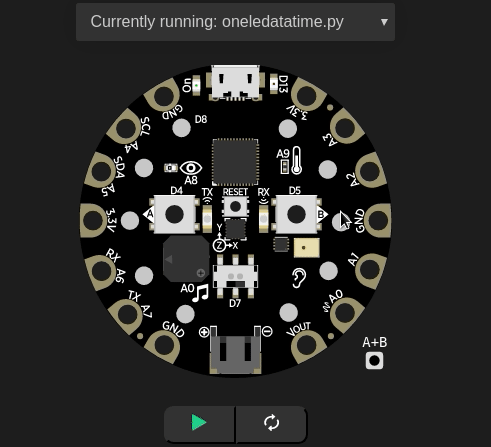
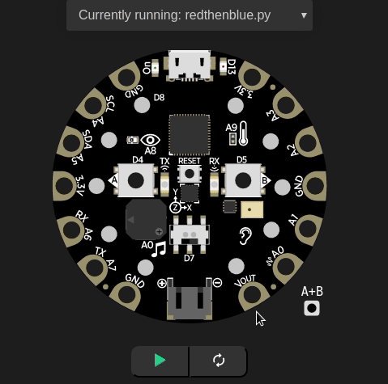

======================
Looping over hardware
======================

In this chapter we learn about looping using hardware (simulation).

One NeoPixel at a time
-----------------------

The `cpx.pixels` can be accessed by index numbers, from 0 to 9. This way, we can turn on 
one NeoPixel at a time.

.. code-block:: python
    :linenos:

    # import CPX library
    from adafruit_circuitplayground.express import cpx
    import time

    BLUE = (0, 0, 255)

    i = 0

    while True:
        # start your code here
        if i == 10:
            time.sleep(10)
            continue
        cpx.pixels[i] = BLUE
        i += 1
        time.sleep(0.5)

On line number *7*, we declared a variable which selects the correct NeoPixel,
and then on line number 14 we are turning on that NeoPixel to Blue color, and
then increasing the variable to go to the next NeoPixel. The conditional *if
statement* on line 11 makes sure that when we turn on all the lights, we sleep
for 10 seconds and continue to do so.

First Red and then Blue
------------------------

Here using two for loops, we are first turning on each NeoPixel in Red and then in Blue.

.. code-block:: python
    :linenos:

    # import CPX library
    from adafruit_circuitplayground.express import cpx
    import time

    RED = (255, 0, 0)
    BLUE = (0, 0, 255)

    while True:
        for i in range(0, 10):
            cpx.pixels[i] = RED
            time.sleep(0.5)

        time.sleep(0.5)

        for i in range(0, 10):
            cpx.pixels[i] = BLUE
            time.sleep(0.5)

