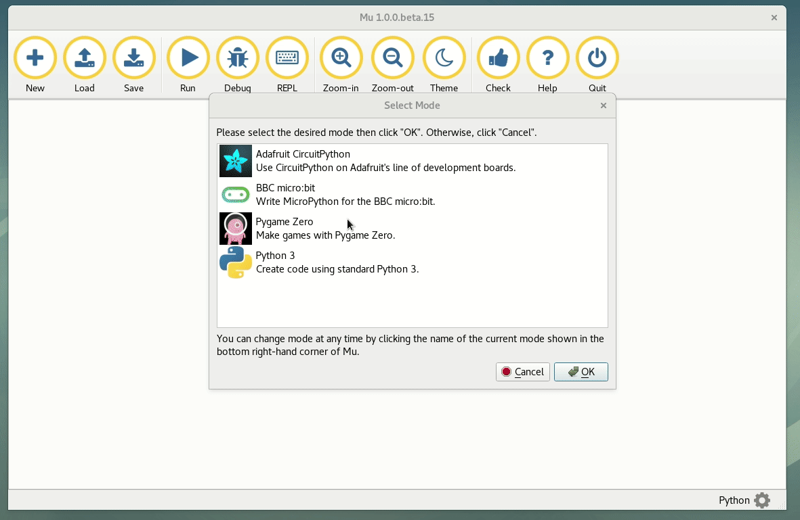
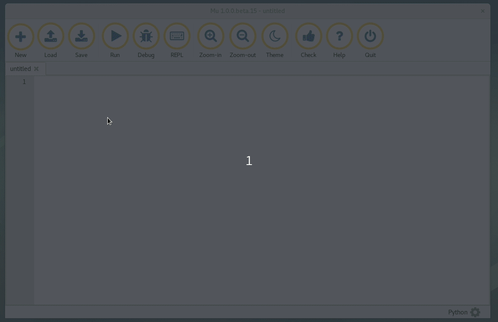

================
Using mu editor
================

Using a proper editor to write code can help a lot while programming or while
working on actual projects. In this chapter we will learn about **mu editor**,
which is a very simple and beginner friendly editor for anyone starting with
Python. It is developed by Nicholas Tollervey.

If you already have an editor of your choice, you can skip this chapter. 

Installation
=============

The total download size is around 150MB. Means it will take some time. Give
the following command as your normal user.

::

    $ python3 -m pip install -U mu-editor --user

Using mu
=========

You can open the editor from the command line, type **mu** in the terminal.

::

    $ python3 -m mu

Select Python 3 at the starting screen. Now, your mu editor is ready.

Executing code
===============

You will have to write any code you want to execute, and then save it with a
proper filename (ends with .py). Then click on the **Run** button to execute
the code. If you want a REPL, then click on the **REPL** button.

.. note:: Remember not to give any space in the filename. Use _ if required, example: download_photos.py

