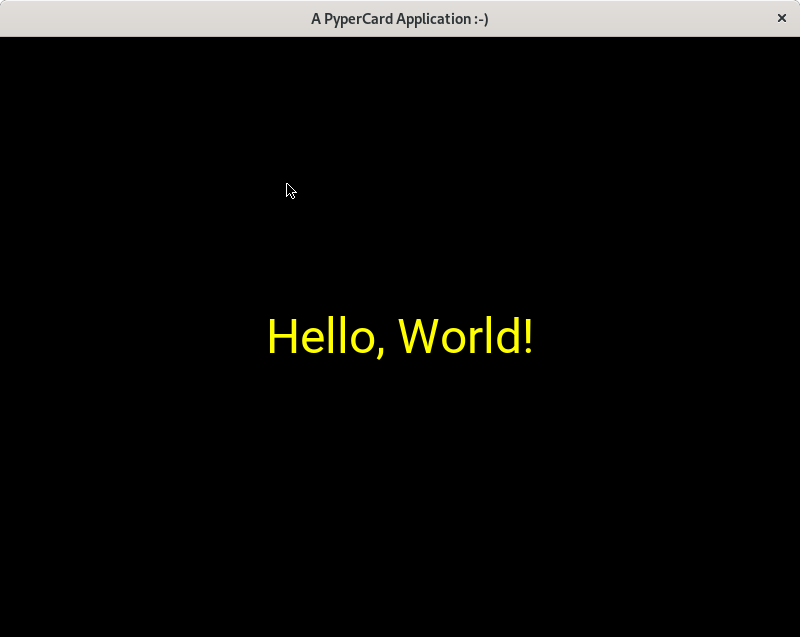
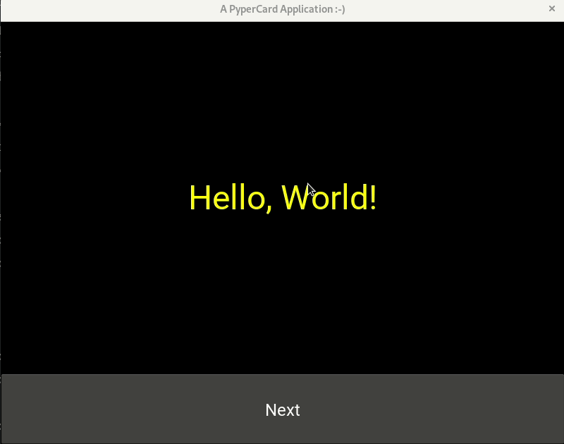
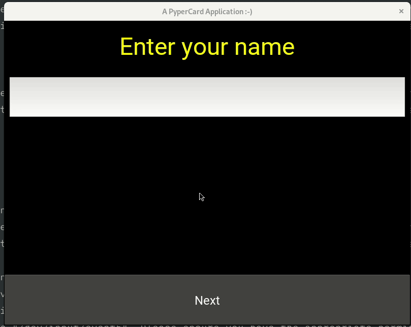
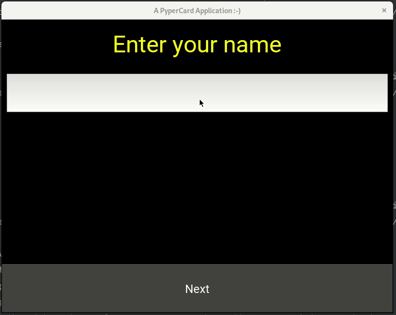

===================================================
Simple GUI application development using PyperCard
===================================================

In this chapter we will learn about creating very simple GUI application using
[PyperCard](https://pypercard.readthedocs.io/en/latest/). PyperCard is a
HyperCard inspired Pythonic GUI framework for beginner programmers.

Installing PyperCard in a virtualenv
-------------------------------------

The first step would be installing PyperCard in a virtualenv.

::

    python3 -m venv venv
    source venv/bin/activate
    python3 -m pip install pypercard

This may take some time, and specially while building Kivy, which is a dependency.

If you see any error in building *Kivy* on your distribution, you will have to install all dependencies
on your operating system.

On Debian Buster

::

    sudo apt install libsdl2-dev libsdl2-image-dev libsdl2-mixer-dev libsdl2-ttf-dev pkg-config libgl1-mesa-dev libgles2-mesa-dev python3-setuptools libgstreamer1.0-dev git-core gstreamer1.0-plugins-{bad,base,good,ugly} gstreamer1.0-{omx,alsa} python3-dev libmtdev-dev xclip xsel libjpeg-dev mesa-common-dev

Hello World example
-------------------

.. code-block:: python
    :linenos:

    from pypercard import Card, CardApp

    card = Card("hello", text="Hello, World!", text_color="yellow")

    app = CardApp(stack=[card, ])
    app.run()

In the first line, we are importing two classes from the module. ``Card`` is
the class for every screen in our application, and ``CardApp`` is the primary
application.

.. note::

    Remember that each card in your application must have an unique name.

If you execute the code, `python3 hello.py`, you will see the following GUI
window. It does not do much, it shows the string "Hello World!" with the text
color we mentioned (Yellow).

Two Cards and a button
-----------------------

.. code-block:: python
    :linenos:

    from pypercard import Card, CardApp

    first_card = Card(
        "first_card",
        text="Hello, World!",
        text_color="yellow",
        buttons=[{"label": "Next", "target": "byescreen"}],
    )
    card2 = Card("byescreen", text="Hack the planet!", text_color="white")

    app = CardApp(stack=[first_card, card2])
    app.run()

In this code, we have two different cards. The ``first_card`` also got a button, with a text *Next*, and the *target* as the name
of the next card to show. In this case, we are showing the card named *bye*

Taking simple text input
-------------------------

In this example, we will learn how to take simple text input.

.. code-block:: python
    :linenos:

    from pypercard import Card, CardApp, Inputs

    def store_name(data_store, form_value):
        """
        Stores the user input in the data_store dictionary
        """
        if form_value:
            data_store["name"] = form_value
            return "showname"
        else:
            return "error"

    card = Card(
        "start",
        text="Enter your name",
        text_color="yellow",
        form=Inputs.TEXTBOX,
        buttons=[{"label": "Next", "target": store_name}],
    )

    card2 = Card("showname", text="May the force be with you {name}.", text_color="white")

    errorcard = Card(
        "error",
        text="You forgot to enter a name",
        text_color="RED",
        buttons=[{"label": "Start again", "target": "start"}],
    )
    app = CardApp(stack=[card, card2, errorcard])
    app.run()

At line 1, we are importing **Inputs**, which has various graphical objects
to take user input.

In line 19, you can see that we passed a new keyword argument to the ``card``
object called *form* and saying that it is a ``Inputs.TEXTBOX``. Another big
change is that as a target of the button, we are passing a function called
``store_name``. This can be any function which takes two arguments, first one
is called ``data_store``, a dictionary passed from the application itself, and
then ``form_value`` is the actual user input via the card. Here, we are
checking if there is a proper user input, then we are storing the value in the
dictionary with the key **name** and returning the next card name
**showname**, otherwise we are showing the **error** card from the stack.

In line 23, we are creating the **showname** card, where you can see we can
directly use any keyname of ``data_store``.

Check name problem
-------------------

Here is a small problem for you, change the code such a way, so that if the
name starts with **Python**, then the next screen will tell us the version of
Python we are running.

.. rst-class:: html-toggle

Check name solution
--------------------

.. code-block:: python
    :linenos:

    from pypercard import Card, CardApp, Inputs
    import sys

    def store_name(data_store, form_value):
        """
        Stores the user input in the data_store dictionary
        """
        if form_value:
            if form_value.startswith("Python"):
                data_store["msg"] = sys.version.replace("\n", "")
            else:
                data_store["msg"] = "May the force be with you {0}.".format(form_value)
            return "showname"
        else:
            return "error"

    card = Card(
        "start",
        text="Enter your name",
        text_color="yellow",
        form=Inputs.TEXTBOX,
        buttons=[{"label": "Next", "target": store_name}],
    )
    card2 = Card(
        "showname",
        text="{msg}",
        text_color="white",
        buttons=[{"label": "Start again", "target": "start"}],
    )

    errorcard = Card(
        "error",
        text="You forgot to enter a name",
        text_color="RED",
        buttons=[{"label": "Start again", "target": "start"}],
    )
    app = CardApp(stack=[card, card2, errorcard])
    app.run()
