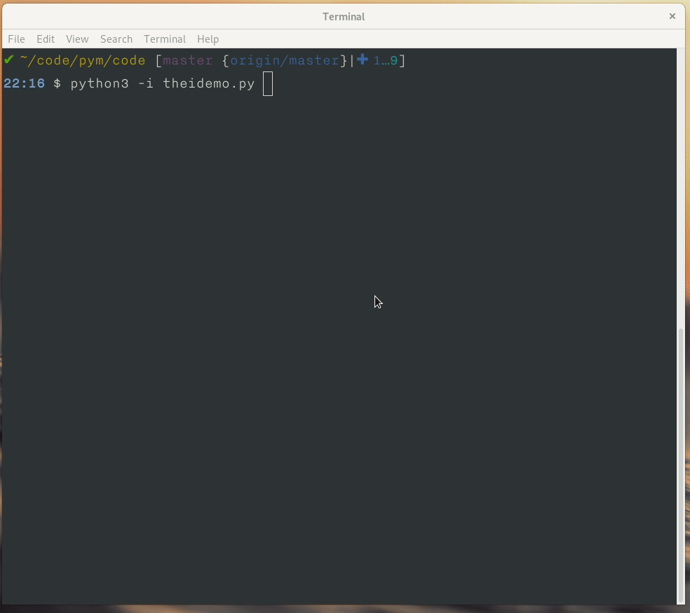

=============
The Beginning
=============

Let's look at our first code, hello world. Because Python is an interpreted
language, you can write the code into the Python interpreter directly or you
can write the code in a file and then run the file. In this topic, we will
first write the code using the interpreter, after starting Python in the
command prompt (shell or terminal). If you are new to Linux command line,
you can read about Linux commands in `this
book <https://lym.readthedocs.io/en/latest/>`.

The following is from Fedora 32 machine.

::

    Python 3.8.2rc1 (default, Feb 12 2020, 00:00:00) 
    [GCC 10.0.1 20200130 (Red Hat 10.0.1-0.7)] on linux
    Type "help", "copyright", "credits" or "license" for more information.
    >>> 

Using the Python interpreter
==============================

In our first code we are going to print "Hello World!" using the interpreter. To generate the output, type the following:

::

    >>> print("Hello World!")
    Hello World!

Using a source file
=====================

As a serious programmer, you might want to write the above code into a source file. Use any text editor you like to create the file called helloworld.py. I used vi. You can even use GUI based tools like `Kate <https://kate-editor.org/get-it/>` or `gedit <https://wiki.gnome.org/Apps/Gedit>`. 

Open a shell or terinal and perform these steps. 

1. Enter the following text:

::

    #!/usr/bin/env python3
    print("Hello World!")

2. Type the following command to make the file executable:

::

    $ chmod +x helloworld.py

3. Run the code by typing the filename.

::

    $ ./helloworld.py
    Hello World!

On the first line you can *#!*, what we call it sha-bang. The sha-bang indicates that the Python interpreter should run this code. On the next line we are printing a text message. In Python we call all the lines of text "strings."

Whitespaces and indentation
===========================

In Python whitespace is an important thing. We divide different identifiers using spaces. Whitespace in the beginning of the line is known as indentation, but if you give wrong indentation it will throw an error. Below are some examples:

::

    >>> a = 12
    >>>  a = 12
    File "<stdin>", line 1
    a = 12
    ^
    IndentationError: unexpected indent

.. warning::
   There is an extra space in the beginning of the second line which is causing the error, so always look for the proper indentation.
   You can even get into this indentation errors if you mix up tabs and spaces. Like if you use spaces and only use spaces for indentation, don't use tabs in that case. For you it may look same, but the code will give you error if you try to run it.

This also introduce us to the first error. It is okay to see more errors while
you are learning to code or learning Python for the first time. Start reading
the errors from the end, and slowly go up (if there are many lines). We will
learn more in the exceptions chapter of this book.

We can have few basic rules ready for spaces and indentation.

- Use 4 spaces for indentation.

- Never mix tab and spaces.

- One blank line between functions.

- Two blank lines between classes.

There are more places where you should be following the same type of whitespace rules:

- Add a space after "," in dicts, lists, tuples, and argument lists and after ":" in dicts.

- Spaces around assignments and comparisons (except in argument list)

- No spaces just inside parentheses.

.. note:: 99% of programming errors I saw are due to typing mistakes. People can learn logic well, but you should be able to type well too. Learn touch typing, that one single skill will help you to become much better programmer than many other skills.

Comments
========

Comments are snippets of English text that explain what this code does. Write comments in the code so that is easier for others to  understand. A comment line starts with *#*. Everything after that is ignored as a comment and does not affect the program.

::

    >>> # This is a comment
    >>> # The next line will add two numbers
    >>> a = 12 + 34
    >>> print(c) #this is a comment too :)

Comments are mainly for people who *develop* or *maintain* the codebase. So if you have any complex code, you should write enough comments inside so that anyone else can understand the code by reading the comments. Always give a space after # and then start writing the comment. You can also use some standard comments like:

::

    # FIXME -- fix these code later
    # TODO -- in future you have to do this

Modules
=======

Modules are Python files that contain different function definitions or variables that can be reused. Module files should always end with a .py extension. Python itself has a vast module library with the default installation. We will use some of them later. To use a module you have to import it first.

::

    >>> import math
    >>> print(math.e)
    2.71828182846

We will learn more about modules in the Modules chapter.

Evaluation your code from a Python file in the interpreter
==========================================================

Many times we want to see how the code is working, and values of different
variables inside of the code. We can do this interactively by copy-pasting the
related code in the interpreter, but there is a better solution. We can use
*-i* flag to the *python* interpreter and then interprets the given code, and
provide the interpreter shell.

We will have the following code in a file name *theidemo.py*.

::

    a = 10
    name = "kushal"
    c = 44
    a = 20

Now let us see how the *-i* flag can be used.

